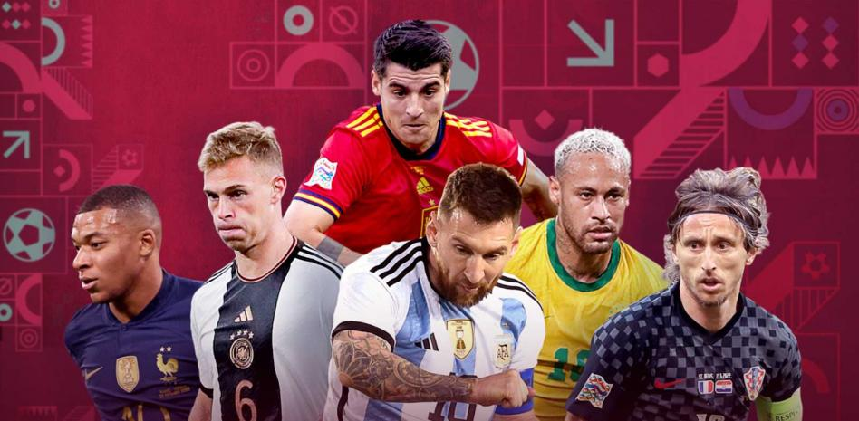

# 🏆 International Football Analysis and Ranking

 <!-- Add an engaging header image -->

## 📌 Overview
This project analyzes football team performance using data from Kaggle. It builds an **Elo ranking system** to evaluate national teams and predicts outcomes for major tournaments like the **UEFA Eurocup** and **Copa América**.

---

## 📊 Key Features
- **Elo Ranking System**: Dynamic rankings of national teams.
- **Predictive Modeling**: Match outcome predictions using statistical models.
- **Visualizations**: Charts and plots for team performance analysis.
- **Simulations**: Tournament outcome predictions for UEFA Eurocup and Copa América.

---

## 📁 Dataset
The dataset includes:
- Match results: Scores, dates, and venues.
- Team data: Historical performance metrics.
- Player stats: Individual performance data.

---

## ⚙️ Methodology
1. **Data Preprocessing**: Cleaning and normalizing datasets.
2. **Exploratory Data Analysis**: Insights into team trends and patterns.
3. **Elo Rankings**: Assigning scores and ranks to teams.
4. **Predictive Models**: Poisson regression and other statistical methods.
5. **Simulations**: Predicting match and tournament outcomes.

---

## 🛠️ Tools & Technologies
- **Languages**: Python
- **Libraries**: Pandas, NumPy, Matplotlib, Scikit-learn
- **Visualization**: Seaborn, Plotly

---

## 🎯 Results
- Dynamic Elo rankings for teams worldwide.
- Accurate match outcome predictions.
- Simulated tournament winners for Eurocup and Copa América.

---

## 🚀 How to Run
1. Clone the repository:
   ```bash
   git clone https://github.com/robertostl/InternationalFootball.git
2. Install dependencies:
   ```bash
   pip install -r requirements.txt
3. Run the notebooks:
   ```bash
   2024-euro-prediction-using-poisson-distribution.ipynb
   WorldResults.ipynb

 ## 📈 Sample Visualizations
  <!-- Add images or links to visualizations -->

 ## 🤝 Contributions
  Contributions are welcome! Fork the repository, create a branch, and open a pull request.

  ## 🙌 Acknowledgments
  Dataset: Kaggle
  
  Inspiration: Football analytics community
